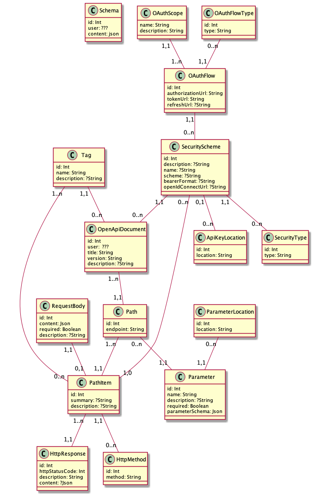

# Reverse OpenAPI

Generate an OpenAPI document with a simple web form.

## Team

- Tan NGUYEN
- Clément HALLER
- Merith NDOLO 
- Samuel BELOLO
- Filoupatir HANNA
- Issam EL MOUTII 
- Marc PIERRON

## Summary 

- [The project](#Reverse-OpenAPI)
    - [Getting started](#Getting-started)
    - [Folder structure](#Folder-structure)
- [Conventions](#Conventions)
    - [Commit conventions](#Commit-conventions)
    - [Branch conventions](#Branch-conventions)
- [Stack](#Stack)
    - [Infrastructure](#Infrastructure)
    - [Api Client container](#Api-client-container)
    - [OpenAPI Service container](#OpenAPI-Service-container)
    - [SQL Fixtures Service container](#SQL-Fixtures-service-container)
    - [Functional test service container](#Functional-test-service-container)
    - [GCP Pub/Sub Emulator container](#GCP-Pub/Sub-Emulator-container)
    - [Entity relationship diagram](#Entity-relationship-diagram)

## Getting started 

Clone and run the project via docker.
```sh
$ docker-compose up
```

## Folder structure

*TODO*

# Conventions
## Commit conventions

Use [Gitmoji](https://gitmoji.dev/) to define the type of the commit.
Rest of the commit message follow the [Conventionnal Commits Specification](https://www.conventionalcommits.org/en/v1.0.0/).

```
:emoji type:[optional scope] <description>

[optional body]

[optional footer(s)]
```

## Branch conventions

Manage branches using the [GitFlow](https://www.atlassian.com/fr/git/tutorials/comparing-workflows/gitflow-workflow#:~:text=git%2Dflow%20est%20un%20outil,ex%C3%A9cuter%20brew%20install%20git%2Dflow%20.) branching model.

```
<service-name>/<feature|release|hotfix|support>/<name>
```

# Stack
## Infrastructure

[insert infrastructure schema]

## Api Client container 

[[`localhost`](http://localhost)]  
A Symfony API consumed by the front-end client.

## OpenAPI Service container

[[`localhost:81`](http://localhost:81)]  
A Symfony service that generates OpenAPI documents.

## SQL Fixtures service container

[[`localhost:82`](http://localhost:82)]  
A symfony service that generates SQL queries and fake data from OpenAPI schemas. 

## Functional test service container

[[`localhost:83`](http://localhost:83)]  
A GO service that generates functional tests for OpenAPI schemas.

## GCP Pub/Sub Emulator container
[[`localhost:8085`](http://localhost:8085)]   
The official [GCP Pub/Sub Emulator](https://cloud.google.com/pubsub/docs/emulator) used to communicate between the api client and services.


## Database container

[[`localhost:3306`](http://localhost:3306)]  
A MySQL database that can be managed with PHPMyAdmin at [`localhost:8080`](http://localhost:8080) :
- username: root
- password: root
 
### Entity relationship diagram

